# 🐋 OCEX ENCICLOPEDIA | HACK THE OCEAN | HACKATON DE LAUNCHX 🐟 
En pleno S.XXI la sociedad sigue desconociendo los animales en peligro de extinción que actualmente se encuentran amenazados en nuestro planeta. Las acciones que provocan un deterioro de la biodiversidad están provocadas por factores humanos y naturales. El mayor impacto negativo y el que sitúa los animales en peligro de extinción es el provocado por el ser humano. 

## 🦀 DESCRIPCIÓN
Elaboramos un proyecto fullstack que de solucion escalable y ágil a una problematica, las especies marinas en peligro de extinción. Decidimos darle solución mediante el uso de un mapa interactivo, marcando las zonas donde se encuentran estos animales en peligro, asi como sus caracteristicas escenciales y datos duros respecto a como han sido afectados a lo largo de los años; esto con el fin de promover la concientización del correcto cuidado del medio ambiente, en este caso del oceano y como nuestras acciones afectan su habitat. Para esto nuestra segunda fase el proyecto es agregar información confiable y pueda generar un impacto en su habitat, sobre las buenas practicas y los cuidados que nosotros como habitantes podemos ejercer.

```mermaid
graph TD
    id1[(Database)] --> WEB
    id2(API MAPBOX) --> WEB 
    WEB --> Introdución
    Introdución --> Storytelling
```

## 🛠 DATOS TÉCNICOS

### 🧪 TECNOLOGIAS APLICADAS

- Node Js
- HTML
- CSS
- JS
- Jest
- Azure

### 📚 ESTRUCTURA DE DIRECTORIOS

## 🌐 ENLACE DEL PROYECTO

## 📖 INTEGRANTES 

| NOMBRE(S)                         |                             Links a Githubs Personales |
| --------------------------------  | ---------------------------------------------------:   |
| `👩 1. Flor Nepomuceno`           |  📎 [Link a Github](https://github.com/FlorNepomuceno) |
| `👨🏻 2. Emmanuel Hernández`        |  📎 [Link a Github](https://github.com/antoni-codes)   |
| `👨🏻 3. Alejandro Aguilar`         |  📎 [Link a Github](https://github.com/alexsarget)     |
| `👨🏻 4. Erick Montes`              |  📎 [Link a Github](https://github.com/ErickMontesDK)  |
